# Прогноз часа пика потребления - Красноярский край

Крупные потребители платят за мощность по своему потреблению в час пика
региона. Угадал час заранее - можно снизить нагрузку именно в него и заплатить
меньше; ошибся - платишь по чужому пику. Этот проект каждый вечер отвечает
на вопрос: в какой час завтра потребление края будет максимальным.

Искать нужно внутри планового окна пиковых часов, которое публикует СО ЕЭС
(2-я ценовая зона): в окне от 6 до 14 часов, обычно 9-11. Метрика - доля
дней, где первый час прогноза совпал с фактическим (top-1). Система
координат: тыкать наугад - около 0.10; всегда называть один и тот же час
(лучший задним числом, 8-й) - 0.25; статистика частот за 3 года - 0.38.
Моя модель - 0.42.

## Результат

Три окна проверки, top-1:

| окно | дней | статистика | лес | + поправка |
|---|---|---|---|---|
| 2023-08 .. 2026-07 | 743 | 0.330 | 0.345 | 0.366 |
| 2024-08 .. 2025-07 (настроечный год) | 248 | 0.290 | 0.323 | 0.339 |
| 2025-08 .. 2026-07 (проверочный год) | 247 | 0.381 | 0.389 | **0.421** |

На проверочном годе top-2 = 0.559, top-3 = 0.700 (у статистики 0.522
и 0.672). Поправка меняет только порядок первых двух мест, состав тройки
не трогает.

Год на год не приходится: top-1 статистики гуляет от 0.29 до 0.38, и вместе
с ней гуляют все модели. Проверочный год вышел легким, самая трезвая строка -
трехлетняя. Важно другое: перевес над статистикой держится во всех трех
окнах - +3.6, +4.9 и +4.0 п.п. По дням проверочного года: обе угадали 83 дня,
только модель - 21, только статистика - 11. Точный парный тест дает p = 0.11:
знак устойчивый, но один год есть один год, поэтому и смотрю на три окна.

В `comparison.xlsx` - сравнение по месяцам с EpicAI: мне прислали таблицу
с ее результатами, я добавил в каждый блок третий столбец со своими
(строится скриптом `scripts/monthly_report.py` по run-id сохраненного
прогона). За 19 месяцев top-1 у меня 0.391 против 0.339, дальше идем
вровень: top-3 0.719 против 0.718, top-5 0.900 против 0.897 - что логично,
поправка первых мест состав тройки не меняет. Чтобы числа не путать:
0.391 - среднее месячных долей, как принято в той таблице, а 0.421 - доля
по дням проверочного года; колонка «Статистика» в файле - из присланной
таблицы, моя статистика частот сильнее (0.381). За декабрь 2025 у EpicAI
прогнозов нет вообще, ее среднее посчитано без декабря; у меня декабрь
посчитан как обычный месяц, top-1 0.409.

## Как это устроено

Общая картина - от источников до прогноза:



У каждой строки в базе записана дата, с которой ее можно было знать, -
на этом держится вся честность проверки.

### Данные

Все время московское. Часы в нотации АТС: «7-й час» - это 06:00-07:00.
Прогнозы делаются на рабочие дни - в отчетах АТС только они.

| источник | что дает |
|---|---|
| отчеты АТС | час пика по дням - это ответ (2011+) и почасовое потребление региона (2013+); выходят 10-го числа за прошлый месяц, то есть с лагом 1-2 месяца |
| pdem | план потребления на завтра по группам точек поставки; известен накануне, история только с января 2025 |
| РСВ | цена и плановый объем рынка на сутки вперед; известны накануне, история с 2015 года |
| погода | open-meteo по 5 городам края с весами по потреблению (Норильска нет: изолированная энергосистема, в ценовую зону не входит); берется вчерашний прогноз на завтра, не факт задним числом |
| календарь | xmlcalendar плюс правка: день, попавший в отчет АТС, считаю рабочим, что бы календарь ни говорил - иначе ковидные «нерабочие» недели 2020-2021 выпадают |
| окна СО | где вообще искать пик; перебиты руками из PDF за 2013-2026 и сверены с данными: максимум почасовки внутри окна совпал с официальным часом пика во всех 3279 днях из 3279 |

### Признаки

На каждый час-кандидат окна собирается 44 числа. Что из них реально работает,
видно по важности в обученном лесу:

| группа (признаков) | важность | пример |
|---|---|---|
| история пиков (5) | 0.32 | как часто час был пиком в этом месяце за 3 года |
| монте-карло по кривым месяца (1) | 0.26 | как часто час выходит максимумом в розыгрышах |
| РСВ (5) | 0.18 | место часа в плановом объеме рынка на завтра |
| погода (12) | 0.06 | температура утром и днем, аномалия к последним неделям |
| календарь (7) | 0.06 | день недели, длина «моста» выходных |
| свет (3) | 0.04 | темно ли в этот час, сколько до заката |
| статика часа (3) | 0.04 | номер часа, место в окне |
| свежие кривые (2) | 0.03 | ранг часа в последних 22 опубликованных днях |
| pdem (6) | 0.01 | место часа в плане на завтра |

Три признака дают больше половины всей важности. Самый весомый одиночный -
монте-карло: по кривым этого же месяца за 3 года считаю средний профиль окна
и то, как часы гуляют вместе, разыгрываю 2000 случайных вариантов дня
и смотрю, кому достается максимум. На плоских днях победитель почти случаен,
и это единственный признак, который это честно измеряет.

Из честного: двенадцать погодных признаков вместе весят меньше одного
монте-карло - погода тут не про уровень потребления, а про сдвиг пика между
утром и днем. А pdem - самый очевидный кандидат «план на завтра от самого
рынка» - почти ничего не весит: истории у него полтора года. Оставил, потому
что история накопится, а пока его работу делает плановый объем РСВ - тот же
смысл, но с 2015 года.

### Шаг 1: лес

Одна строка обучения - пара «день + час-кандидат» с меткой, был ли этот час
пиком. На день приходится одна единица и около десятка нулей. Лес учится как
обычный бинарный классификатор, порядок часов - сортировка его вероятностей
внутри дня; при равенстве выше более ранний час (тем же правилом АТС решает
ничьи в фактах).

Почему лес, а не бустинг: данных мало, цель шумная, и бэггинг здесь
стабильно обыгрывает LightGBM - проверял и классификатором, и lambdarank.
Настройки (600 деревьев, min_samples_leaf 23, max_features 0.96) подбирал
Optuna на настроечном годе: два независимых запуска, 120 попыток. Верхние
попытки отличаются на день-два из 248 - это плато, любая из них дала бы
то же самое. Обучение с 2021 года по двум причинам: привычки потребления
уплывают, а главное - архив вчерашних прогнозов погоды существует только
с марта 2021, раньше честного признака «что обещали на завтра» просто нет.

### Шаг 2: попарная поправка

Лес хорошо отбирает тройку, но иногда путает порядок внутри нее. Поверх
работает маленькая логистическая регрессия, обученная на парах «какой из
двух часов вероятнее»:



Из 32 срабатываний на проверочном годе 18 попали, 10 сместили правильный
час, в 4 было мимо и до, и после. Итог +3.2 п.п.; на настроечном годе
и трех годах поправка дает +1.6 и +2.1 п.п. - всегда в плюс, но размер
плавает, поэтому порог такой осторожный. Без порога поправка начинает
суетиться и делает хуже. Порог и тип модели выбраны на отложенном хвосте
обучения, не на проверочном годе.

### Честная проверка

Никакого подглядывания вперед: модель переобучается 1-го числа каждого
месяца только на днях, чей ответ к этому моменту опубликован, и месяц
работает без изменений. Между последним обучающим днем и первым прогнозным
всегда около месяца - это не выбор, а устройство рынка:


Про сам регион модель знает данные месячной давности, про завтра - только
план рынка и погоду. Отсюда весь дизайн признаков. Это касается и мелочей:
фактическая погода в архиве появляется с задержкой около 5 дней, поэтому
«тепло ли на фоне последних недель» считается по дням не ближе недели назад.

## Сколько тут вообще можно выжать

`scripts/ceiling_sim.py` берет настоящие кривые, добавляет шум и смотрит,
как часто максимум остается на месте. Типичный отрыв победителя от второго
места - 0.29% дневного уровня, у четверти дней меньше 0.13%: решают сотые
доли. Ошибка моего прогноза формы дня - 0.87% на час (`scripts/curve_sigma.py`).
При таком шуме потолок примерно 0.42, если ошибки часов независимы, и около
0.5, если соседние часы ошибаются вместе - а второе ближе к правде. То есть
запас над моими 0.37-0.42 еще есть, но небольшой, и это потолок подхода
«предскажи кривую и возьми максимум», а не предел вообще.

Главный путь наверх - свежие почасовые данные по самому региону. Такой ряд
существует: сторонняя почасовка по ГТП (`ext_load`) приходит уже на
следующий день, но использовать ее по условию нельзя, она в базе только для
разведки. Все остальное официальное отстает на 10-40 дней.

## Что пробовал, в финал не вошло

* Отдельная модель формы дня (`src/curve.py`, модель `rfx`): LightGBM
  предсказывает, как завтрашняя кривая отклонится от типичной, и эти
  прогнозы идут добавкой в лес. На настроечном годе не обошла простой лес
  (top-1 0.310 против 0.323). Код оставил - на нем держится расчет потолка.
* Попарная модель «час против часа» на всей истории с 2015-го: неплохо,
  но результат сильно зависит от того, на каком периоде учить.
* Голосование нескольких моделей - не лучше одного леса с подобранными
  настройками.
* Схема «сначала утро или день, потом час внутри» - почти всегда отвечала
  «день» и теряла утренние пики.
* Почасовое потребление всей ОЭС Сибири (публикуется почти сразу) - сигнал
  размыт соседними регионами, связь слишком слабая.
* TabPFN - на уровне леса, добавки нет.

## Как запустить

Куда смотреть в коде:

```
src/features.py    44 признака, вся дисциплина «не знать будущее»
src/models.py      модели ранжирования часов
src/backtest.py    помесячное переобучение и метрики
src/curve.py       регрессия формы дня (в финал не вошла, кормит расчет потолка)
src/ingest.py      парсеры источников
scripts/           бэктест, подбор настроек, прогноз, сводки
```

В `dataset/` лежит готовая база (10 МБ), собирать ее из сырых файлов
не нужно:

```bash
python3 -m venv .venv
.venv/bin/pip install -r requirements.txt
.venv/bin/python scripts/import_dataset.py        # dataset/ -> db/peak.sqlite

.venv/bin/python scripts/run_backtest.py clim     # статистика частот, ~минута
.venv/bin/python scripts/rerank_eval.py --stage1 \
  "et:n_estimators=600,min_samples_leaf=23,max_features=0.96" --tf 2021-01-01
```

Последняя команда повторяет 0.421/0.559/0.700 на проверочном годе - прогон
трех лет с помесячным переобучением, на обычном процессоре меньше часа.
Метрики за все три года целиком - тот же скрипт с `--eval-from 2023-08-01`.

Прогноз на завтра (когда подгружены свежие данные):

```bash
.venv/bin/python scripts/predict.py
```

Поправка топ-3 включается сама, если в базе есть сохраненный прогон
(появляется после rerank_eval.py). В `models/final.joblib` - веса финальной
модели, обученные на всем опубликованном к сентябрю 2026
(`scripts/train_final.py`); это контрольная точка, predict.py по умолчанию
учится заново от текущей базы за пару минут.

Сборка базы с нуля из первоисточников: `scripts/download_all.py`, дальше
шаги `build_db.py` (порядок - в его докстринге), `backfill_weather.py`,
`fetch_rsv.py` + `ingest_aux.py`.
